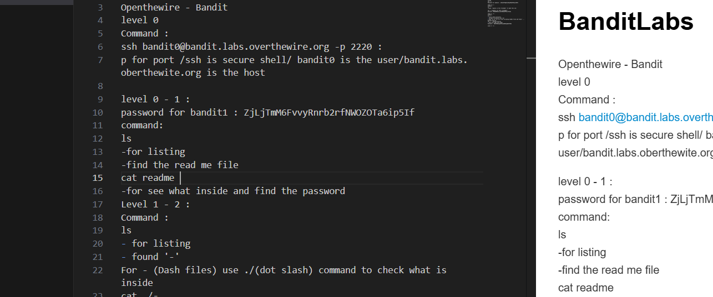

# BanditLabs

Openthewire - Bandit
level 0
Command : 
ssh bandit0@bandit.labs.overthewire.org -p 2220 : 
p for port /ssh is secure shell/ bandit0 is the user/bandit.labs.oberthewite.org is the host
------------------------------

---------------------------------------------------------
level 0 - 1 : 
password for bandit1 : ZjLjTmM6FvvyRnrb2rfNWOZOTa6ip5If
command: 
ls 
-for listing
-find the read me file
cat readme 
-for see what inside and find the password
Level 1 - 2 : 
Command : 
ls 
- for listing
- found '-'
For - (Dash files) use ./(dot slash) command to check what is inside
cat ./- 
Password for bandit2 : 263JGJPfgU6LtdEvgfWU1XP5yac29mFx

level 2- 3 : 
Command : 
ls
-found --spaces in this filename-- to open this use:

cat ./--spaces\ in\ this\ filename--
password :MNk8KNH3Usiio41PRUEoDFPqfxLPlSmx

level 3 - 4 : 
Command : 
ls
- found inhere directory 
- to open a directory use "cd"
- then 'ls -a' for all files including hidden files and found '...Hiding-From-You'
cat ./...Hiding-From-You 
- this will open the folder
Password : 2WmrDFRmJIq3IPxneAaMGhap0pFhF3NJ

Level 4 - 5 : 

