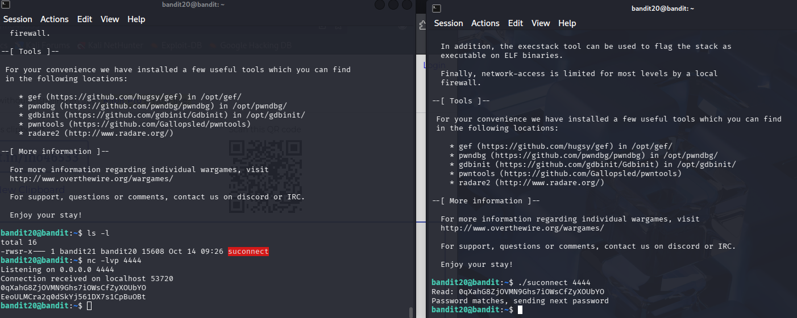
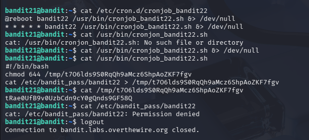
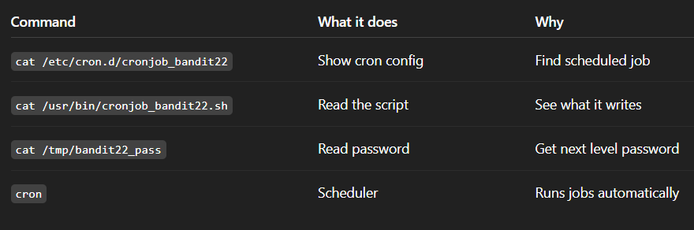
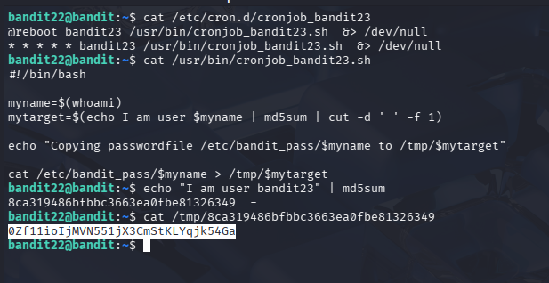
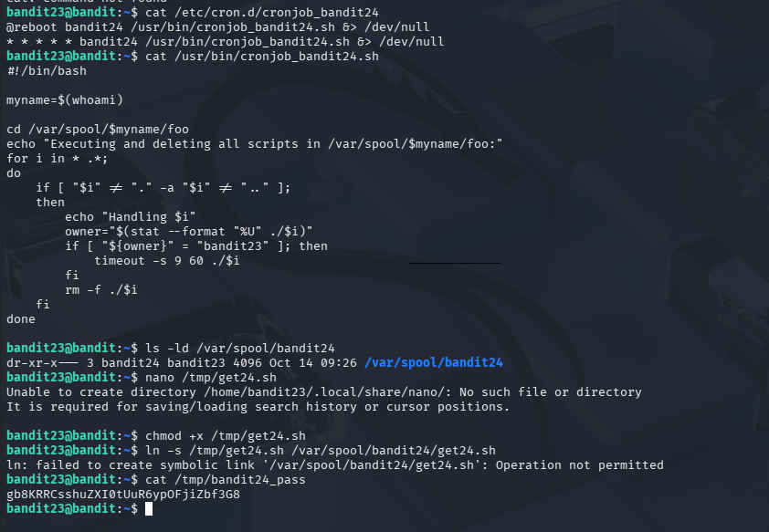
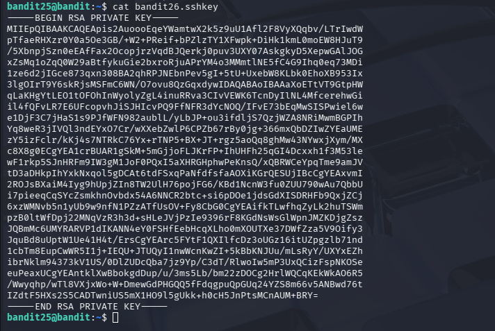
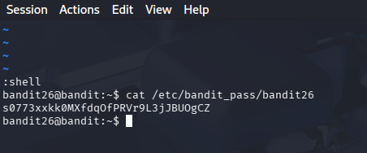

# BanditLabs

Open the [BanditLabs](https://banditlabs.com/) website.
## level 0
>Command 
```bash
ssh bandit0@bandit.labs.overthewire.org -p 2220
```
Explination : 
- p for port 
- ssh is secure shell
- bandit0 is the user
- bandit.labs.oberthewite.org is the host
>Password : 
```bash
bandit0
```

## level 0 to level 1
>Command 
```bash
ssh bandit1@bandit.labs.overthewire.org -p 2220
ls
cat readme
```
Explination :
- ls is for list
- cat is for read
- readme is the file to be read from the list of files
>Password : 
```bash
ZjLjTmM6FvvyRnrb2rfNWOZOTa6ip5If  
```

## level 1 to level 2
>Command 
```bash
ssh bandit2@bandit.labs.overthewire.org -p 2220
ls  
cat ./-
```
Explination :
- ls is for list
- cat is for read
- For - (Dash files) use ./(dot slash) command to check what is inside
- ./- is the file to be read from the list of files
>Password : 
```bash 
263JGJPfgU6LtdEvgfWU1XP5yac29mFx
``` 

## level 2 to level 3
>Command  
```bash
ssh bandit3@bandit.labs.overthewire.org -p 2220
ls  
cat ./--spaces\ in\ this\ filename--  
```
Explination :
- ls is for list
- cat is for read
- -found --spaces in this filename-- to open this use:
- ./--spaces\ in\ this\ filename-- is the file to be read from the list of files  
>Password : 
```bash     
MNk8KNH3Usiio41PRUEoDFPqfxLPlSmx
``` 

## level 3 to level 4 
>Command 
```bash
ssh bandit4@bandit.labs.overthewire.org -p 2220
ls  
cd inhere  
ls  
cat ./...Hiding-From-You  
```
Explination :
- ls is for list
- cat is for read
- cd is for change directory
- cd inhere to open this use:
- ./...Hiding-From-You is the file to be read from the list of files  
>Password : 
```bash     
2WmrDFRmJIq3IPxneAaMGhap0pFhF3NJ
``` 
## level 4 to level 5 
>Command 
```bash
ssh bandit5@bandit.labs.overthewire.org -p 2220
ls  
find . -type f -exec file {} \; | grep ASCII ./-file07: ASCII text

bandit4@bandit:~/inhere$ find . -type f -exec file {} \; | grep ASCII | cut -d: -f1 | xargs cat
```


Explination :
- ls is for list
- cd is for change directory
- find . -type f -exec file {} \; | grep ASCII ./-file07: ASCII text to locate the file
- find . -type f -exec file {} \; | grep ASCII | cut -d: -f1 | xargs cat
- ./-file07 is the file to be read from the list of files
with the last command we can get the password present in the file 7 directly from the terminal
password : 
```bash     
4oQYVPkxZOOEOO5pTW81FB8j8lxXGUQw
```
## level 5 to level 6
>Command 
```bash    
ssh bandit6@bandit.labs.overthewire.org -p 2220
ls
find . -type f ! -executable -size 1033c -exec file {} \; | grep 'ASCII' | cut -d: -f1 | xargs cat
```


Explination :
- ls is for list
- cd is for change directory
- find inhere: Starts the search in the inhere directory.
- type f: Looks for regular files.
- ! -executable: Excludes executable files.
- size 1033c: Searches for files that are exactly 1033 bytes (c stands for bytes).
- exec file {} \;: For each file found, run the file command to determine its type (human-readable text).
- grep 'ASCII': Filters the files that are human-readable (ASCII text).
- cut -d: -f1: Extracts just the filenames from the file output.
- xargs cat: Passes the filenames to cat to display the contents of the file.

with the last command we can get the password present in the file 7 directly from the terminal

password : 
```bash
HWasnPhtq9AVKe0dmk45nxy20cvUa6EG
```
## level 6 to level 7
>Command 
```bash    
ssh bandit7@bandit.labs.overthewire.org -p 2220
find / -type f -user bandit7 -group bandit6 -size 33c 2>/dev/null -exec cat {} \;
```


Explination : 
- find / → search the entire filesystem
- type f → only regular files
- user bandit7 → owned by user bandit7
- group bandit6 → owned by group bandit6
- size 33c → exactly 33 bytes (c = bytes)
- 2>/dev/null → hides permission denied errors (important)
- exec cat {} \; → prints the file contents (the password)

password : 
```bash 
morbNTDkSW6jIlUc0ymOdMaLnOlFVAaj
``` 
## level 7 to level 8
>Command 
```bash    
ssh bandit8@bandit.labs.overthewire.org -p 2220
grep millionth data.txt
```


Explination : 
- grep millionth data.txt → search for the millionth line in the data.txt file

password : 
```bash 
dfwvzFQi4mU0wfNbFOe9RoWskMLg7eEc
```
## level 8 to level 9
>Command 
```bash    
ssh bandit9@bandit.labs.overthewire.org -p 2220
sort data.txt | uniq -u
``` 


Explination : 
- sort data.txt → sort the data.txt file
- uniq -u → remove duplicate lines

password : 
```bash 
4CKMh1JI91bUIZZPXDqGanal4xvAg0JM
``` 
## level 9 to level 10
>Command 
```bash    
ssh bandit10@bandit.labs.overthewire.org -p 2220
strings data.txt | grep "^==="
```


Explination : 
- strings data.txt → extract strings from the data.txt file
- grep "^===" → search for lines that start with "==="

password : 
```bash 
FGUW5ilLVJrxX9kMYMmlN4MgbpfMiqey
``` 
## level 10 to level 11
>Command 
```bash    
ssh bandit11@bandit.labs.overthewire.org -p 2220  
base64 -d data.txt
```


Explination : 
- base64 -d data.txt → decode the base64 data.txt file
- -d for decode

password : 
```bash 
dtR173fZKb0RRsDFSGsg2RWnpNVj3qRr
``` 
## level 11 to level 12
>Command 
```bash    
ssh bandit12@bandit.labs.overthewire.org -p 2220
cat data.txt | tr 'A-Za-z' 'N-ZA-Mn-za-m'
```


Explination : 
- cat data.txt → read the data.txt file
- tr 'A-Za-z' 'N-ZA-Mn-za-m' → translate the characters A-Za-z to N-ZA-Mn-za-m

password : 
```bash 
7x16WNeHIi5YkIhWsfFIqoognUTyj9Q4
``` 
## level 12 to level 13
>Command  
```bash    
ssh bandit13@bandit.labs.overthewire.org -p 2220
cd /tmp
mktemp -d
cd /tmp/tmp.ABC123xyz
cp ~/data.txt .
xxd -r data.txt > data
file data
data: gzip compressed data

mv data data.gz
gunzip data.gz

mv data data.bz2
bunzip2 data.bz2

mv data data.tar
tar -xf data.tar

cat data
```

Explination : 
- cd /tmp → change directory to /tmp
- mktemp -d → create a temporary directory
- cd /tmp/tmp.ABC123xyz → change directory to the temporary directory
- cp ~/data.txt . → copy the data.txt file to the temporary directory
- xxd -r data.txt > data → decode the data.txt file
- file data → identify the file type
- gzip → bzip2 → gzip → tar → gzip → tar → bzip2 → ASCII
- mv data data.gz → rename the data file to data.gz
- gunzip data.gz → decompress the data.gz file
- mv data data.bz2 → rename the data file to data.bz2
- bunzip2 data.bz2 → decompress the data.bz2 file
- mv data data.tar → rename the data file to data.tar
- tar -xf data.tar → extract the data.tar file
- cat data → read the data file
- repeat the steps until the password is found


password : 
```bash 
FO5dwFsc0cbaIiH0h8J2eUks2vdTDwAn
``` 
## level 13 to level 14
>Command 
```bash    
ssh bandit14@bandit.labs.overthewire.org -p 2220
scp -P 2220 bandit13@bandit.labs.overthewire.org:~/sshkey.private ~/
chmod 600 ~/sshkey.private
ls -l ~/sshkey.private  
ssh -i /home/kali/sshkey.private bandit14@bandit.labs.overthewire.org -p 2220
cat /etc/bandit_pass/bandit14
``` 
Explination :
- 1st logged out from level 13
- use whoami to get the username then
- use scp to copy the private key to the current directory [-P 2220 bandit13@bandit.labs.overthewire.org:~/sshkey.private ~/]
- use chmod to change the permissions of the private key to 600
- use ls to check the permissions of the private key
- use ssh to login to level 14 with the private key
- use cat to read the password

password : 
```bash 
MU4VWeTyJk8ROof1qqmcBPaLh7lDCPvS
```
## level 14 to level 15
>Command 
```bash 
nc localhost 30000  
cat /etc/bandit_pass/bandit14
```
Explination : 
- nc localhost 30000 → connect to localhost on port 30000
- it shows a blank screen then we have to type the password


password : 
```bash 
8xCjnmgoKbGLhHFAZlGE5Tmu4M2tKJQo    
``` 
## level 15 to level 16
>Command 
```bash 
ssh bandit16@bandit.labs.overthewire.org -p 2220    
openssl s_client -connect localhost:30001
```
Explination : 
- ssh bandit16@bandit.labs.overthewire.org -p 2220 → login to level 16
- openssl s_client -connect localhost:30001 → connect to localhost on port 30001
- it shows a blank screen then we have to type the password


password : 
```bash 
kSkvUpMQ7lBYyCM4GBPvCvT1BfWRy0Dx
```
## level 16 to level 17
>Command 
```bash 
ssh bandit17@bandit.labs.overthewire.org -p 2220
nmap -p 31000-32000 localhost : <port>
openssl s_client -connect localhost:31790
```
After getting the key from the ports we logged out from the bandit and used the kali to get into bandit 17

>Command 
```bash 
nano ~/bandit17.key
chmod 600 ~/bandit17.key
ls -l ~/bandit17.key
ssh -i ~/bandit17.key bandit17@bandit.labs.overthewire.org -p 2220
``` 
Explination :
- nmap is for network mapping
- -p is the ports to be scanned
- localhost is the host to be scanned
- <port> is the port to be scanned

 

- openssl s_client -connect localhost:31790 → connect to localhost on port 31790
- it shows a blank screen then we have to type the password 
- nano is for editing the file
- we will copy the key from the ports and paste it in the file [cnrl+o to save the file and cnrl+x to exit the nano editor]
- chmod is for changing the permissions of the file
- ls is for listing the file
- ssh is for secure shell
- -i is for identity file
- bandit17@bandit.labs.overthewire.org is the host
- 2220 is the port
- with this we are logging into bandit 17
- to read the 17b password we have to run the command ' 'cat /etc/bandit_pass/bandit17'

password : 
```bash 
EReVavePLFHtFlFsjn3hyzMlvSuSAcRD password for bandit 17
```
## level 17 to level 18
>Command 
```bash 
ls
diff password.old password.new

```


Explination :
- ls is for listing the files
- diff is for comparing the files
- password.old is the old file
- password.new is the new file
- > this indicted key is the password for bandit 18

password : 
```bash 
x2gLTTjFwMOhQ8oWNbMN362QKxfRqGlO
```
## level 18 to level 19
>Command 
```bash 
ssh bandit18@bandit.labs.overthewire.org -p 2220
ssh bandit18@bandit.labs.overthewire.org -p 2220 cat readme
```


Explination :
- ssh bandit18@bandit.labs.overthewire.org -p 2220 this command will end up saying byebye from the bandit 18
- ssh bandit18@bandit.labs.overthewire.org -p 2220 cat readme asks for a password then use [x2gLTTjFwMOhQ8oWNbMN362QKxfRqGlO]
- cat readme will print the file that contains bandit19 password
- it will give you another password use that for bandit 19

password : 
```bash 
cGWpMaKXVwDUNgPAVJbWYuGHVn9zl3j8
```
## level 19 to level 20
>Command 
```bash
ssh bandit20@bandit.labs.overthewire.org -p 2220
ls -l
./bandit20-do cat /etc/bandit_pass/bandit20
```


Explination :
- SUID runs a program with the owner's permissions
- it is also called as privilege escalation
- it runs on the binary file
- ls -l will print the list of files
- ./bandit20-do Runs the special SUID program
- cat is for read
- /etc/bandit_pass/bandit20 is the file to be read from the list of files

password : 
```bash 
0qXahG8ZjOVMN9Ghs7iOWsCfZyXOUbYO
```
## level 20 to level 21
In termina #1
>Command 
```bash
ssh bandit21@bandit.labs.overthewire.org -p 2220
ls -l
nc -lvp 4444
```
In termina #2
>Command 
```bash
ssh bandit21@bandit.labs.overthewire.org -p 2220
./suconnect 4444
```


Explination :
- ls -l will print the list of files
- nc -lvp 4444 will listen on port 4444
- nc is for netcat
- lvp is for listen on port
- ./suconnect 4444 will connect to port 4444
- we send a connecting request from 1st terminal to another terminal 
- after that we see the connected message from the 2nd terminal
- then entering the bandit 20 password will give us the password for bandit 21

password : 
```bash     
EeoULMCra2q0dSkYj561DX7s1CpBuOBt
```
## level 21 to level 22
>Command 
```bash
ssh bandit22@bandit.labs.overthewire.org -p 2220
cat /etc/cron.d/cronjob_bandit22
cat /usr/bin/cronjob_bandit22.sh
```


Explination :
- cat is for read
- /etc/cron.d/cronjob_bandit22 is the file to be read from the list of files
- /usr/bin/cronjob_bandit22.sh is the file to be read from the list of files
- cronjob is a scheduler
- cornjobs is for scheduling automated tasks
- cronjob_bandit22 is the name of the scheduler
- cronjob_bandit22.sh is the file to be executed by the scheduler



password : 
```bash 
tRae0UfB9v0UzbCdn9cY0gQnds9GF58Q
```
## level 22 to level 23
>Command 
```bash
ssh bandit23@bandit.labs.overthewire.org -p 2220    
cat /etc/cron.d/cronjob_bandit23
cat /usr/bin/cronjob_bandit23.sh
echo "I am user bandit23" | md5sum
cat /tmp/<hash code from previous command>
```


Explination :
- cat is for read
- /etc/cron.d/cronjob_bandit23 is the file to be read from the list of files
- /usr/bin/cronjob_bandit23.sh is the file to be read from the list of files
- cronjob is a scheduler
- cornjobs is for scheduling automated tasks
- cronjob_bandit23 is the name of the scheduler
- cronjob_bandit23.sh is the file to be executed by the scheduler
- echo is for printing, it will print the "i am user bandit23" in md5sum format
- md5sum is for hashing the message
- /tmp/<hash code from previous command> is the file to be read from the list of files

Password : 
```bash 
0Zf11ioIjMVN551jX3CmStKLYqjk54Ga
```
## level 23 to level 24
>Command 
```bash
ssh bandit24@bandit.labs.overthewire.org -p 2220
cat /etc/cron.d/cronjob_bandit24
cat /usr/bin/cronjob_bandit24.sh
ls -ld /var/spool/bandit24
nano /tmp/get24.sh
chmod +x /tmp/get24.sh
ln -s /tmp/get24.sh /var/spool/bandit24/get24.sh
cat /tmp/bandit24_pass
```
Explination :
- cat is for read
- /etc/cron.d/cronjob_bandit24 is the file to be read from the list of files
- /usr/bin/cronjob_bandit24.sh is the file to be read from the list of files
- cronjob is a scheduler
- cornjobs is for scheduling automated tasks
- cronjob_bandit24 is the name of the scheduler
- cronjob_bandit24.sh is the file to be executed by the scheduler
- ls is for listing the files
- -ld /var/spool/bandit24 is the file to be read from the list of files
- nano is for editing the file, and create a file named get24.sh in the /tmp directory
- /tmp/get24.sh is the file to be read from the list of files
- chmod is for changing the permissions of the file
- ln is for linking the file
- -s /tmp/get24.sh /var/spool/bandit24/get24.sh is the file to be read from the list of files



Password : 
```bash 
gb8KRRCsshuZXI0tUuR6ypOFjiZbf3G8
```

## level 24 to level 25
>Command 
```bash
ssh bandit25@bandit.labs.overthewire.org -p 2220
nc localhost 30002
mkdir /tmp/brute
cd /tmp/brute
nano list.txt
nano script.sh
ls
chmod +x script.sh
./script.sh
cat list.txt | nc localhost 30002
```
   

Script : 
```bash
#!/bin/bash

for i in {0..9} {0..9} {0..9} {0..9}
do
        echo "gb8KRRCsshuZXI0tUuR6ypOFjiZbf3G8 $i" >> list.txt;
done

```

Explination :
- nc is for network communication
- localhost is the host to be scanned
- 30002 is the port to be scanned
- mkdir is for creating a directory
- /tmp/brute is the directory to be created
- cd is for changing the directory
- nano is for editing the file, and create a file named script.sh in the /tmp/brute directory
- nano list.txt is the file to be read from the list of files
- ls is for listing the files
- chmod is for changing the permissions of the file
- ./script.sh is the file to be executed by the shell
- cat is for read
- list.txt is the file to be read from the list of files 


Password : 
```bash
iCi86ttT4KSNe1armKiwbQNmB3YJP3q4
```
## level 25 to level 26
>Command 
```bash
ssh bandit26@bandit.labs.overthewire.org -p 2220
ls
cat bandit26.sshkey
```
Copy the key from the above command



Open the new terminal because the admins disabled the ability to SSH from localhost entirely so we are using a new terminal to copy and paste the key to change the permissions

>command 
```bash
nano bandit26.key
chmod 600 bandit26.key
ssh -i bandit26.key bandit26@bandit.labs.overthewire.org -p 2220
```
before using this last command we have to shrink the terminal to short  or else we cant get the results. after entering the command we will see like more 33% then we have to use the below commands

>command 
```bash
v no enter just v
:set shell=/bin/bash press enter
:shell press enter
```
Now we are in the bandit 26 shell


>command 
```bash
cat /etc/bandit_pass/bandit26
```
Explination :
- we have the bandit26 key but we are not able to get the shell password
- so 1st i copied the key and opened a new terminal
- then i copied the key to the new terminal
- then i changed the permissions of the key
- then i logged into the bandit 26 shell using this command [ssh -i bandit26.key bandit26@bandit.labs.overthewire.org -p 2220]
- then used the v command and entered into the visual editor mode 
- then used this command [:set shell=/bin/bash] press enter
[:shell] press enter
- then used this command [cat /etc/bandit_pass/bandit26] to get the password



Password : 
```bash 
s0773xxkk0MXfdqOfPRVr9L3jJBUOgCZ
```
## level 26 to level 27
>Command